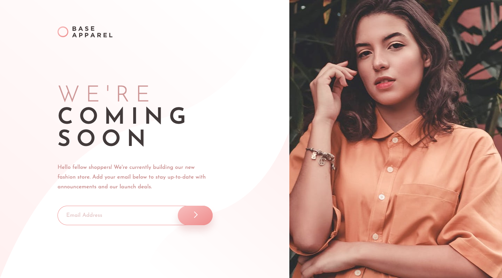

# Base Apparel Coming Soon Page Solution

This is a solution to the [Base Apparel coming soon page challenge on Frontend Mentor](https://www.frontendmentor.io/challenges/base-apparel-coming-soon-page-5d46b47f8db8a7063f9331a0). The goal is to replicate a simple, responsive "Coming Soon" page design for a fashion brand. The page features an email subscription form to notify users about the store launch.

**Built with:** HTML, CSS/Scss, and JavaScript for form validation.

**Features:** Responsive design optimized for both mobile and desktop & Email input validation.

## Screenshot and Links

| [Demo URL](https://ionstici.github.io/base-apparel-coming-soon) | [Frontend Mentor](https://www.frontendmentor.io/solutions/base-apparel-coming-soon-page-92YwO0syBP) |
| --------------------------------------------------------------- | --------------------------------------------------------------------------------------------------- |

